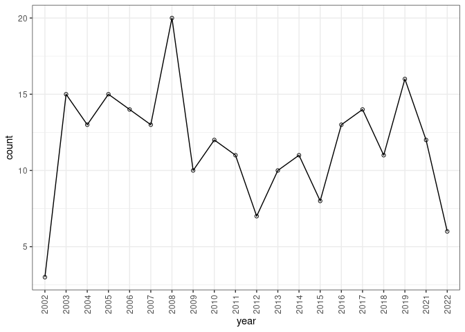
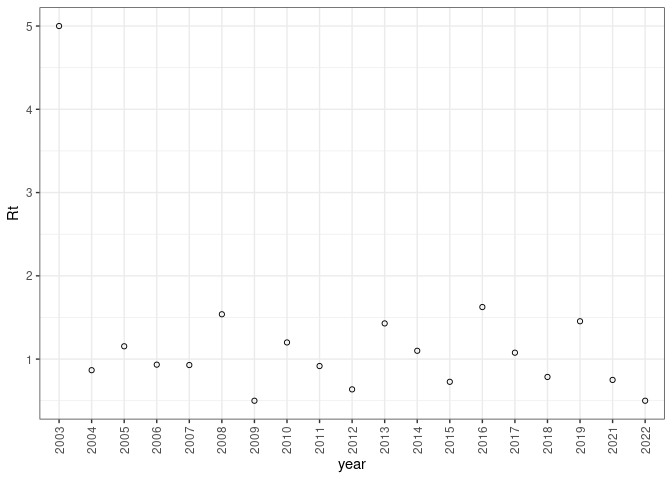
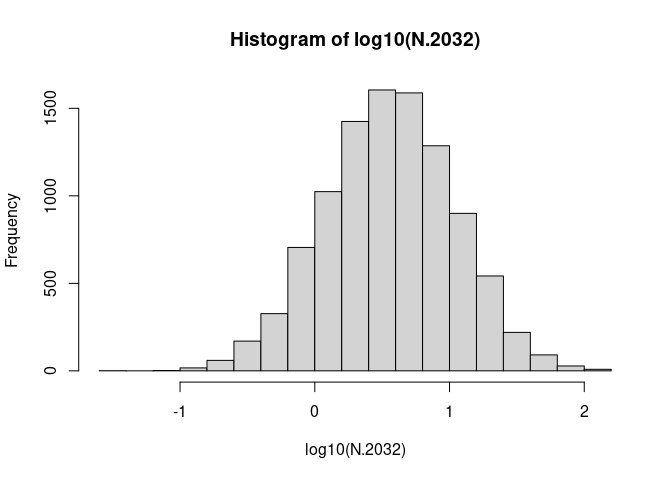
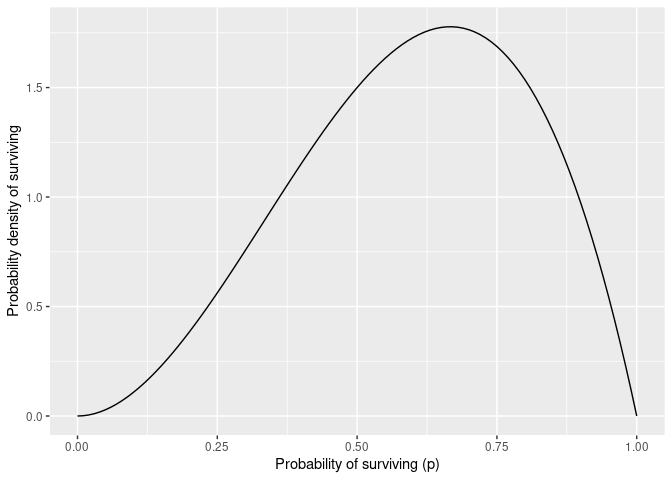

Shetland BBS - density independent growth analysis
================
Anthony W
2022-02-12

``` r
library(primer)
```

    ## Loading required package: deSolve

    ## Loading required package: ggplot2

``` r
library(tidyverse)
```

    ## ── Attaching packages ─────────────────────────────────────── tidyverse 1.3.1 ──

    ## ✔ tibble  3.1.8      ✔ dplyr   1.0.10
    ## ✔ tidyr   1.2.1      ✔ stringr 1.4.0 
    ## ✔ readr   2.1.2      ✔ forcats 0.5.1 
    ## ✔ purrr   1.0.0

    ## ── Conflicts ────────────────────────────────────────── tidyverse_conflicts() ──
    ## ✖ dplyr::filter() masks stats::filter()
    ## ✖ dplyr::lag()    masks stats::lag()

Load some data

``` r
# Load all staring data
data <- readxl::read_xlsx("data/Starling.xlsx")

# Select single survey 1km2 - HU3617
survey <- data %>% filter(Starling == "HU3617") %>%
  select(-Starling) %>%
  mutate_if(is.character, as.numeric) %>%
  pivot_longer(cols = everything(),
               names_to =  "year",
               values_to = "count")
```

Now the survey count of Starlings across time:

``` r
survey %>%
  ggplot(aes(x=year, y=count, group=1)) + 
  geom_path() + 
  geom_point(pch=1) +
  theme_bw() +
  theme(axis.text.x = element_text(angle = 90, vjust = 0.5, hjust=1))
```

<!-- -->

Now we can calculate the annual observed growth rate, Rt = Nt+1/Nt

``` r
survey <- survey %>% mutate(Rt = count/lag(count))
```

Plot change in growth rate

``` r
survey %>%
  na.omit() %>%
  ggplot(aes(x=year, y=Rt)) +
  geom_point(pch=1) +
  theme_bw() +
  theme(axis.text.x = element_text(angle = 90, vjust = 0.5, hjust=1))
```

<!-- -->

Year 1 looks like a bit of an outlier…

## Simulation

We can randomly sample the annual growth rate from the survey data, in
order to simulate future population growth rate over a given time
period. We can then bootstrap this to establish the distribution. We
baseline the population in the first year of our forecast as 1, as we
are only interest in the rate of growth (not absolute population
numbers).

Before doing this we remove the first year of growth, as this looks like
an outlier, as well as the first data point as this always has NA for
Rt.

``` r
survey_clean <- survey[3:20,]
years <- 10 # Simulate 10 years into the future
N <- rep(0, years+1) 
# Baseline the initial population given the population from 2022 = 6
N[1] <- 6 

# Make sequence pseudo random
set.seed(42)
# Draw a sample of our observed R with replacement, "years" times.
rRs <- sample(x=survey_clean$Rt, size=years, replace = TRUE)

#Simulate a path
for (t in 1:years) { 
# starting with year = 1, and for each subsequent year, do... 
N[t+1] <- N[t] * rRs[t]
}

# Plot the result
qplot(0:years, N, geom=c("point","line"))
```

    ## Warning: `qplot()` was deprecated in ggplot2 3.4.0.

<!-- --> \## Multiple
simulations - distribution of possible futures

The following function provides a simulation:

``` r
myForLoop <- function(obs.R, years, initial.N) {
  ## obs.R - observed annual growth rates, 
  ## years - the number of years that we want to simulate,
  ## initial.N - the initial population size.
  
  # select all R at random
  rR <- sample(obs.R, size=years, replace=TRUE)
  # create a vector to hold N
  N <- numeric(years+1)
  # give it an initial population size
  N[1] <- initial.N
  # Do the for-loop
  
  # For each year...
  for( t in 1:years ) {
    # project the population one time step
      N[t+1] <-  N[t] * rR[t]
  }
  # return the vector of N
  N
} 
```

We can run the simulation function multiple times

``` r
# specify the number of simulations and for how long
sims=10000
years=10
initialCount = 6

# make the randomizations repeatable
set.seed(3)
obs.R <- survey_clean$Rt

outmat <- replicate(sims,   
             expr=myForLoop(obs.R=obs.R, years=years, initial.N=initialCount)
                    )
```

Now let’s extract the last year of the simulations, and plot a
distribution of the log of the growth rate.

``` r
N.2032 <- outmat[11,]
summary(N.2032)
```

    ##     Min.  1st Qu.   Median     Mean  3rd Qu.     Max. 
    ##   0.0376   1.7041   3.6191   6.4451   7.6364 137.4634

``` r
hist(log10(N.2032))
```

<!-- --> So what is
the expected survival probability??

``` r
persisting <- as.numeric(N.2032 >=1)
(p <- sum(persisting)/length(persisting))
```

    ## [1] 0.8719

What is the uncertainty associated with this? We will find an intuitive
Bayesian answer to the question: What is the probability that the
Starling would become extinct in this region, due to these inherent
processes?

``` r
base <- ggplot() + xlim(0, 1)

base + 
  geom_function(fun = dbeta, args = list(shape1 = 3, shape = 2)) + 
  labs(y="Probability density of surviving",
       x="Probability of surviving (p)")
```

<!-- -->
